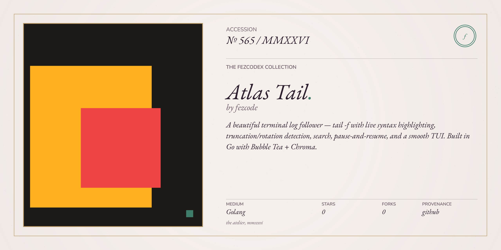

# atlas.tail 📜

A beautiful, high-performance terminal log follower — `tail -f` with level-aware coloring and a live TUI. Built with Go and the Atlas Suite philosophy.



## Overview

`atlas.tail` is a minimalist alternative to `tail -f`, built for watching logs and traces in real time. It colors lines by severity, dims timestamps, and stays out of your way — no editor chrome, no syntax highlighter trying to parse your JSON.

## Features

- **Live Follow:** Polls the file for appended content and auto-scrolls to the latest line.
- **Level-aware coloring:** ERROR / WARN / INFO / DEBUG / TRACE lines tint by severity; leading timestamps are dimmed.
- **Live rate:** Header shows lines/sec alongside total line count and file size.
- **Truncation-safe:** Detects file truncation/rotation and reloads automatically.
- **Pause & Resume:** Pause to inspect history; a counter shows how many new lines arrived while paused.
- **Line selection & yank:** Visual line-mode selection, copy to system clipboard.
- **Find:** Forward/backward search through the buffered tail, with a match counter.
- **Refresh:** `Ctrl+R` re-reads the file from scratch.

## Installation

```bash
gobake build
```

## Usage

```bash
# Follow a log file interactively (default: last 10 lines, 300 ms polling)
atlas.tail server.log

# Start from the last 200 lines and poll every 100 ms
atlas.tail -N 200 -i 100 server.log

# Show the current tail and exit (no follow)
atlas.tail -F server.log

# Show version
atlas.tail -v
```

## Flags

- `-N <n>`       Number of lines to show initially (default `10`, `0` for all)
- `-i <ms>`      Poll interval in milliseconds (default `300`)
- `-l`           Show line numbers
- `-w`           Wrap long lines
- `-F`           Do not follow; print the tail and exit
- `-v`           Show version

## TUI Controls

- **f**              Toggle follow on/off (pins cursor to tail when enabled)
- **G, end**         Jump to tail and actively follow
- **g, home**        Jump to top (pauses follow)
- **up/down, k/j**   Move cursor by line (pauses follow)
- **pgup/pgdn**      Page up/down
- **/**              Find
- **n / N, p**       Next / previous match
- **v**              Start / stop line selection; up/down extends
- **y**              Yank selection to clipboard
- **Ctrl+C**         Copy selection (or quit if no selection)
- **Ctrl+A**         Select all
- **Ctrl+R**         Refresh (reload file from disk)
- **l**              Toggle line numbers
- **w**              Toggle line wrapping
- **q**              Quit
